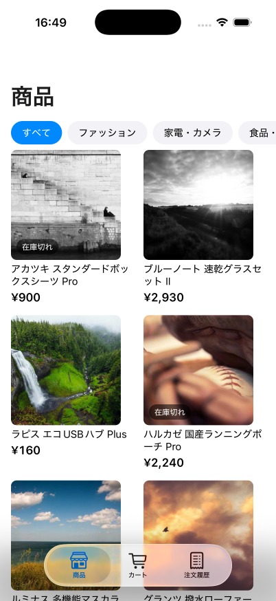
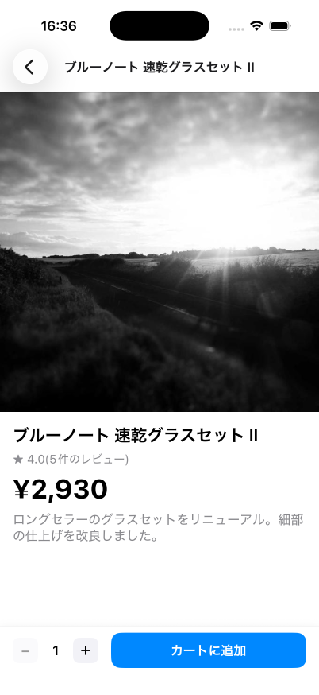
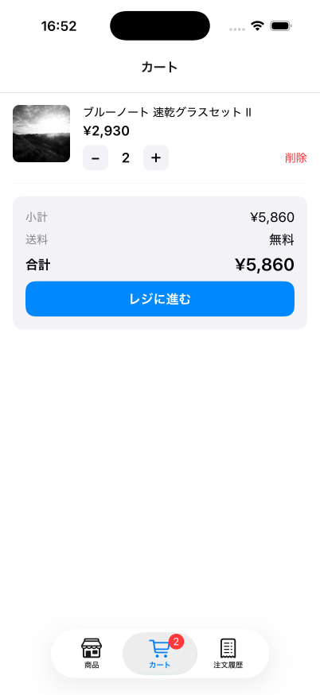
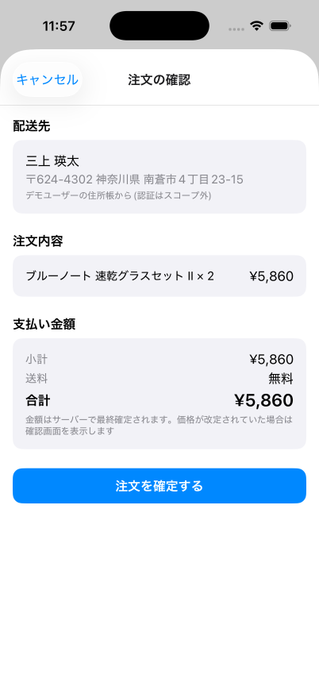
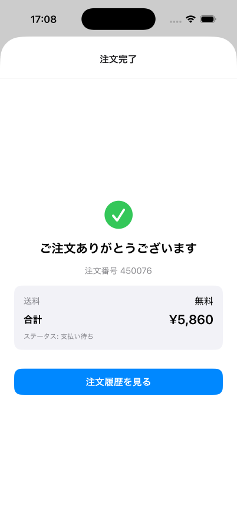
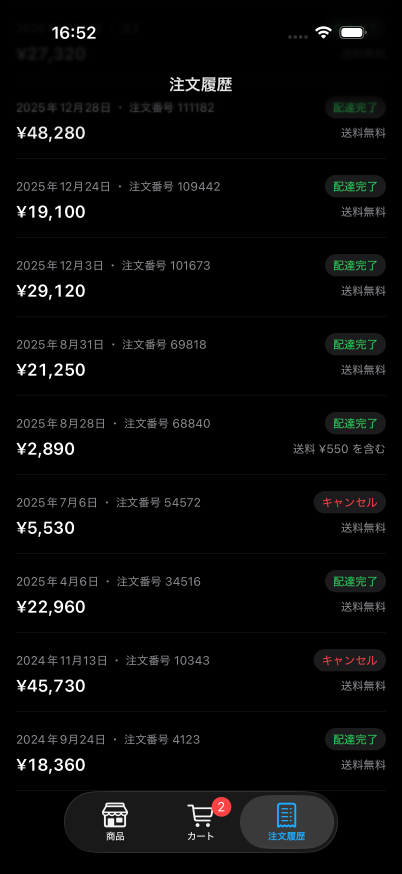
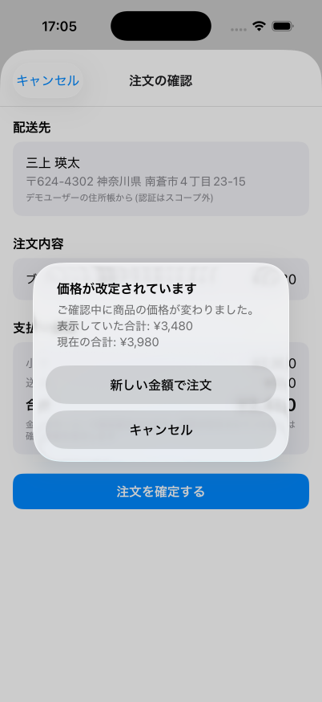
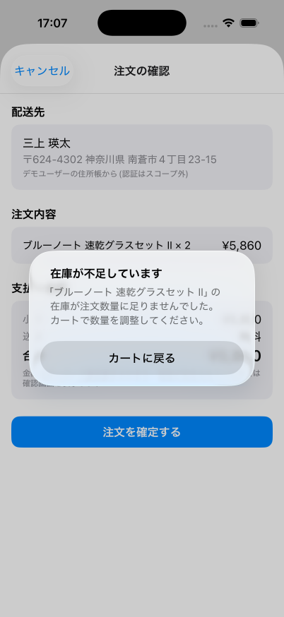
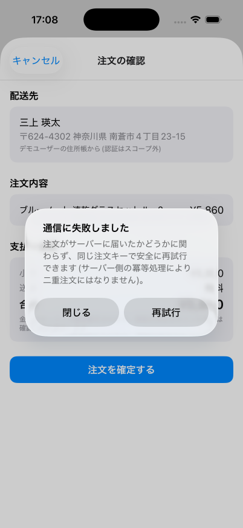

# ec-learning mobile — バックエンド設計を実演する5画面のECアプリ

[ec-learning](../README.md)(架空ECで学ぶSQL・API設計)のフェーズC。
自作した Go API と PostgreSQL(商品5万件・注文明細120万件)に実接続する
React Native + Expo アプリです。**エラー系UXがこのアプリの見せ場** —
バックエンドで設計した冪等キー・サーバー側価格決定・カーソルページネーションを、
画面の振る舞いとして実演します。

<p align="center">
  
</p>

## 画面

| 商品一覧 | 商品詳細 | カート |
|---|---|---|
|  |  |  |
| iOS 26 の Liquid Glass タブバー(スクロールで最小化)・ラージタイトル・カーソル無限スクロール | ヘッダータイトル=商品名・sticky CTA・レビュー0件と平均0点を区別表示 | 在庫上限つき数量変更。サマリーはタブバーに埋まらないようスクロール内容化 |

| 注文確認 | 注文完了 | 注文履歴(ダーク) |
|---|---|---|
|  |  |  |
| 金額はサーバーが最終確定する旨を明示 | 表示金額はすべてサーバー応答の確定値 | セマンティックカラーでライト/ダーク自動追従 |

## 見せ場: エラー系UX(サーバーの「エラー→HTTP対応表」と対をなすUI)

| 409 price_changed | 409 insufficient_stock | 通信断+冪等リトライ |
|---|---|---|
|  |  |  |

- **価格改定(409 price_changed)**: クライアントは `expected_total_jpy` を送り、サーバーが
  価格改定を検知したら新旧合計をダイアログ提示。承諾するとサーバーが返した
  `actual_total_jpy` で再注文する — 金額を決めるのは常にサーバー(API設計3原則)
- **在庫不足(409 insufficient_stock)**: 応答の `product_id` からカート内の商品名を
  解決して表示。在庫の最終防衛はサーバーのアトミックな `UPDATE ... WHERE stock >= qty`
- **通信断**: `Idempotency-Key` を画面表示時に採番し、リトライでは同じキーを再送。
  注文がサーバーに届いていた場合も UNIQUE 制約が吸収し**二重注文にならない**
  (シミュレータで API プロセスを落として実証: リトライ後の注文数はちょうど +1)

3シナリオとも「DBの価格・在庫を直接操作」「APIプロセスを停止」して実際に発生させ、
シミュレータ上で再現・検証済み。

## 技術構成

| 領域 | 選定 | 補足 |
|---|---|---|
| フレームワーク | Expo SDK 57(development build) | 開発UIの写り込み等の理由で Expo Go から移行 |
| ルーティング | expo-router / **NativeTabs**(本物の UITabBarController) | Liquid Glass・タブ最小化・ネイティブバッジ |
| データ取得 | TanStack Query | `useInfiniteQuery` × サーバーの `next_cursor`(カーソル方式 [ADR 006](../docs/decisions/006-pagination.md)) |
| クライアント状態 | zustand | カートのみ(DBにカートを作らない決定) |
| デザイン | セマンティックカラー + 自作トークン(`src/theme/`) | トークン逸脱の監査: 4件/1,683行・全件意図コメント付き。アクセントは systemBlue |
| パッケージ管理 | pnpm(mise でバージョン固定) | 操作の入口はリポジトリルートの mise タスク |

## 設計の要点

- **API契約は型で固定**: `src/api/types.ts` は Go 側 json タグの1:1写し。エラーも
  `ApiError{status, body}` に統一し(ネットワーク断も status=0 で契約に畳む)、
  エラーUXは `instanceof` 1本で分岐する
- **差し替え境界**: `src/api/client.ts` の関数シグネチャが画面との境界。
  モック実装 → fetch 実装の差し替えで、画面側に必要だった変更は AbortSignal の配線だけ
- **規約**: コンポーネントは `components/<name>/<name>.tsx` のディレクトリ単位
  (`.web.tsx` 分岐余地)。`src/app/` はルート専用、画面本体は `src/screens/`
- **検証**: [agent-device](https://github.com/callstack/agent-device) でエージェントが
  シミュレータを直接操作し、スクリーンショット→評価→修正のループで磨いた

## 動かし方

```sh
# リポジトリルートで(DB・API)
mise run up && mise run migrate && mise run seed && mise run load
mise run api-run                 # Go API(:8080)

# モバイル
mise run mobile-install
mise run mobile-prebuild         # CNG: ios/ は生成物(git管理外)
mise run mobile-ios              # ローカルビルド → iPhone 17 Pro シミュレータで起動(EC_IOS_DEVICE で端末差し替え)
mise run mobile-check            # tsc + eslint
```

前提: 認証はスコープ外(デモユーザー固定 — `src/constants.ts`)。
iOS 優先(Liquid Glass は iOS 26+。Android は Material フォールバック前提のコメントを各所に残置)。
