# ec-learning mobile — バックエンド設計を実演する5画面のECアプリ

[ec-learning](../README.md)(架空ECで学ぶSQL・API設計)のフェーズC。
自作した Go API と PostgreSQL(商品5万件・注文明細120万件)に実接続する
React Native + Expo アプリです。**エラー系UXがこのアプリの見せ場** —
バックエンドで設計した冪等キー・サーバー側価格決定・カーソルページネーションを、
画面の振る舞いとして実演します。

<p align="center">
  
</p>

## 画面

| 商品一覧 | 商品詳細 | カート |
|---|---|---|
|  |  |  |
| iOS 26 の Liquid Glass タブバー(スクロールで最小化)・ラージタイトル・カーソル無限スクロール | ヘッダータイトル=商品名・sticky CTA・レビュー0件と平均0点を区別表示 | 在庫上限つき数量変更。サマリーはタブバーに埋まらないようスクロール内容化 |

| 注文確認 | 注文完了 | 注文履歴(ダーク) |
|---|---|---|
|  |  |  |
| 金額はサーバーが最終確定する旨を明示 | 表示金額はすべてサーバー応答の確定値 | セマンティックカラーでライト/ダーク自動追従 |

## 見せ場: エラー系UX(サーバーの「エラー→HTTP対応表」と対をなすUI)

| 409 price_changed | 409 insufficient_stock | 通信断+冪等リトライ |
|---|---|---|
|  |  |  |

- **価格改定(409 price_changed)**: クライアントは `expected_total_jpy` を送り、サーバーが
  価格改定を検知したら新旧合計をダイアログ提示。承諾するとサーバーが返した
  `actual_total_jpy` で再注文する — 金額を決めるのは常にサーバー(API設計3原則)
- **在庫不足(409 insufficient_stock)**: 応答の `product_id` からカート内の商品名を
  解決して表示。在庫の最終防衛はサーバーのアトミックな `UPDATE ... WHERE stock >= qty`
- **通信断**: `Idempotency-Key` を画面表示時に採番し、リトライでは同じキーを再送。
  注文がサーバーに届いていた場合も UNIQUE 制約が吸収し**二重注文にならない**
  (シミュレータで API プロセスを落として実証: リトライ後の注文数はちょうど +1)

3シナリオとも「DBの価格・在庫を直接操作」「APIプロセスを停止」して実際に発生させ、
シミュレータ上で再現・検証済み。

## Apple Watch(閲覧のみ)

| 商品一覧 | 商品詳細 |
|---|---|
| 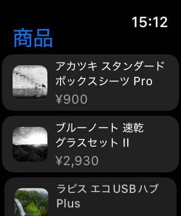 | 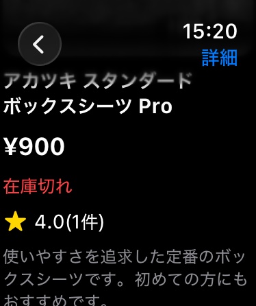 |
| 先頭1ページ(20件)のみ。Watch は glanceable な端末なので無限スクロールは持ち込まない | 価格・在庫(在庫切れは赤)・評価・説明。iPhone 側と同じ `GET /products/:id` を Watch から直接取得 |

React Native は watchOS で動かないため、Watch 側は SwiftUI のネイティブ実装(`targets/watch/`)。
`@bacons/apple-targets` が prebuild のたびに Xcode ターゲットとして注入するので CNG は維持される。
JSON 契約は `src/api/types.ts` と 1:1 の Swift 構造体(snake_case はデコーダで吸収)。
同居方法・取得経路の選択肢と根拠は [ADR 008](../docs/decisions/008-apple-watch-browsing.md)。

## 注文の Live Activity(iOS)

| ロック画面 | Dynamic Island(展開) | Dynamic Island(compact) |
|---|---|---|
| 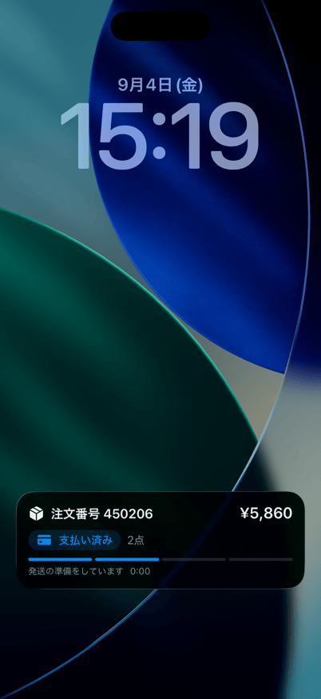 | 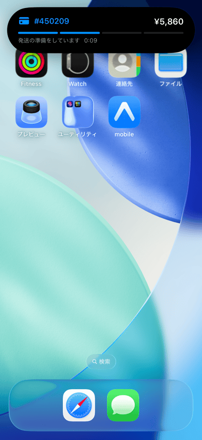 | 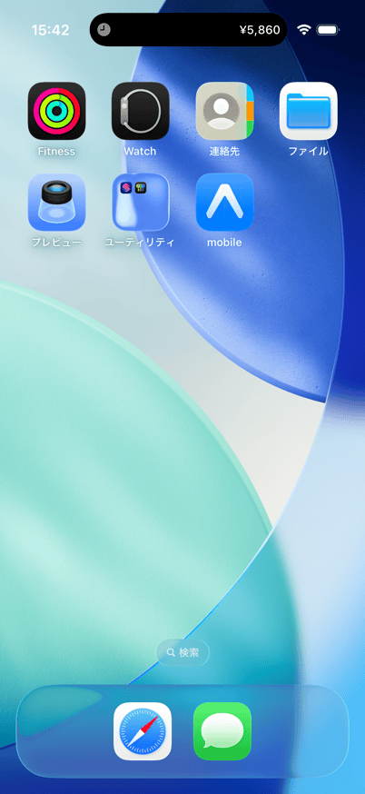 |
| 注文番号・合計(サーバー確定値)・点数・ステータス・4段の進捗トラック。カウントダウンは OS が自走 | 左に注文番号、右に合計、下に進捗。タップで履歴タブへ(`eclearning://orders`) | アイコン=ステータス(色も履歴画面と同じ対応)、右に合計 |

注文確定(`POST /orders` 成功)の瞬間に開始する。UI は WidgetKit 拡張の SwiftUI
(`targets/order-activity/`、Watch と同じ `@bacons/apple-targets` 経由)で、JS からの開始・更新・終了は
自作のローカル Expo Module(`modules/order-live-activity/`)が ActivityKit を叩く。Android / web では
モジュールがリンクされず no-op になる。

- **進捗はクライアント側の疑似**: サーバーは `orders.status` を `pending` から変えない(イベントは UPDATE しない原則)ため、
  `src/live-activity/order-activity-stage.ts` の時間割(デモ規模: +15秒 paid / +45秒 shipped / +90秒 delivered)で進める
- **バックグラウンドでは状態が進まない**: JS のタイマーはサスペンドで止まる。復帰時に経過時間から再計算して追いつく。
  ロック中に動くのはウィジェット側の `Text(timerInterval:)` だけ。正道は APNs push(残課題)
- **二重開始しない**: 通信断リトライ(冪等リプレイ)で同じ注文が返っても、ネイティブ側が `orderId` で既存の Activity を探して更新に倒す
- **終了条件**: delivered 後は開始から1時間で自動消滅 / 履歴タブを開いたら即終了 / 起動時は OS 側に残る Activity から
  追跡を復元し、期限切れだけを掃除(強制終了→再起動でも進行を引き継ぐ)

`ActivityAttributes` は本体側とウィジェット側の両方でコンパイルする必要があり、実体1ファイルへの
シンボリックリンクで共有している(podspec の相対パスは CocoaPods に無視される — 実測)。
方式の選択肢と根拠は [ADR 009](../docs/decisions/009-order-live-activity.md)。

## Web(同じコードベースをブラウザで)

| 商品一覧(1280px) | 商品詳細(2カラム) |
|---|---|
| 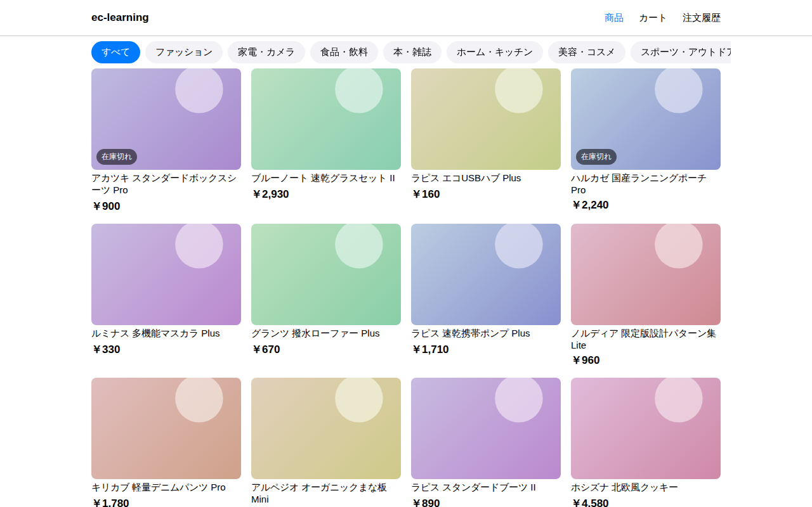 | 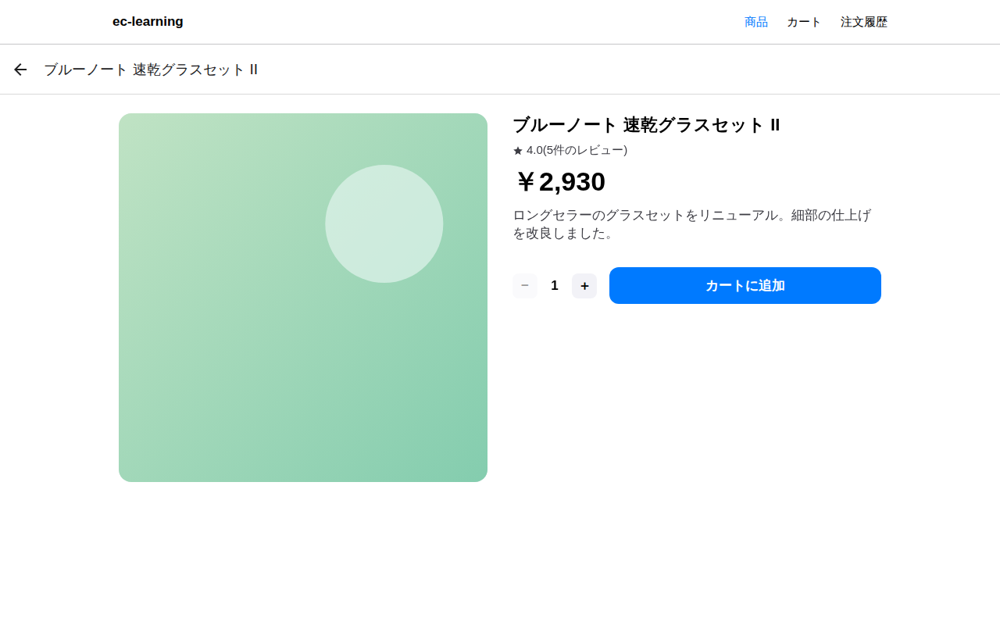 |
| ヘッダーナビ(カートは右上 — web EC の規約)+ 幅に応じて 2/3/4 列に切り替わるグリッド | 768px 以上で画像と情報/CTA の2カラム。ネイティブは縦積み + 固定フッターのまま |

| カート | 注文確認 | 注文履歴 |
|---|---|---|
| 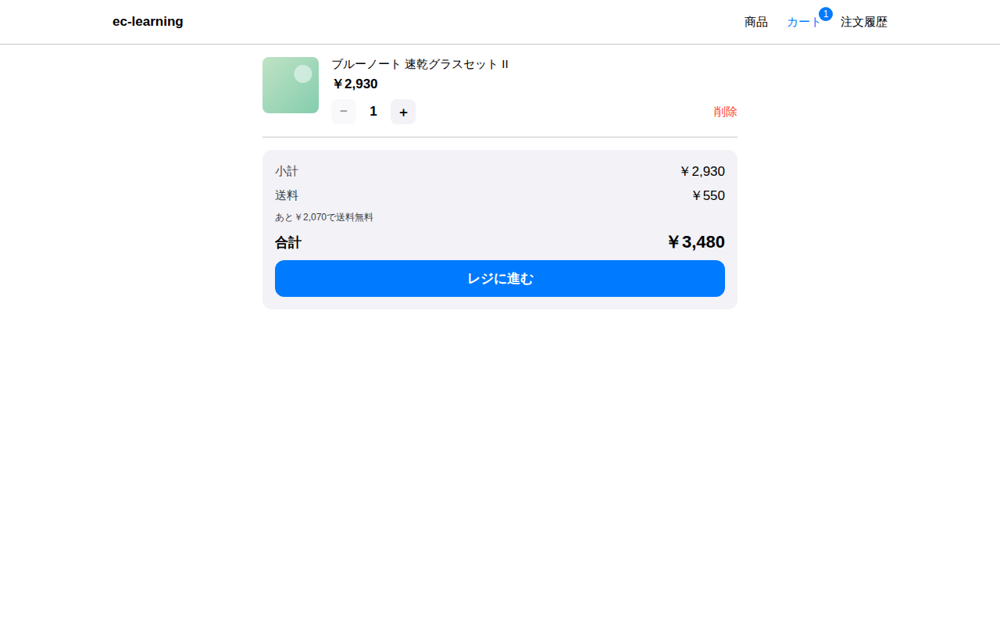 | 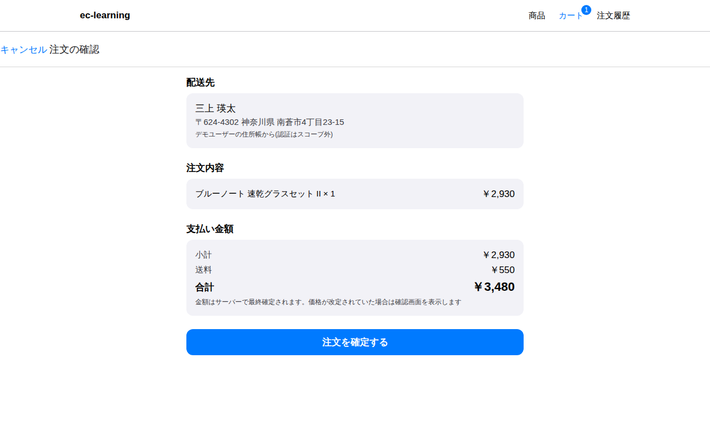 | 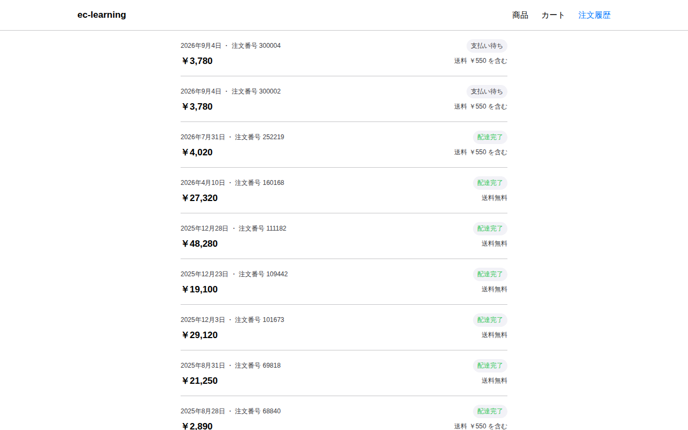 |
| ヘッダーのカートバッジは zustand の同じストアから | フォーム・明細系は 640px の1カラムに中央寄せ | サーバーの `next_cursor` で無限スクロール(ネイティブと同じフック) |

| 409 price_changed(web ダイアログ) | 狭幅(390px) |
|---|---|
| 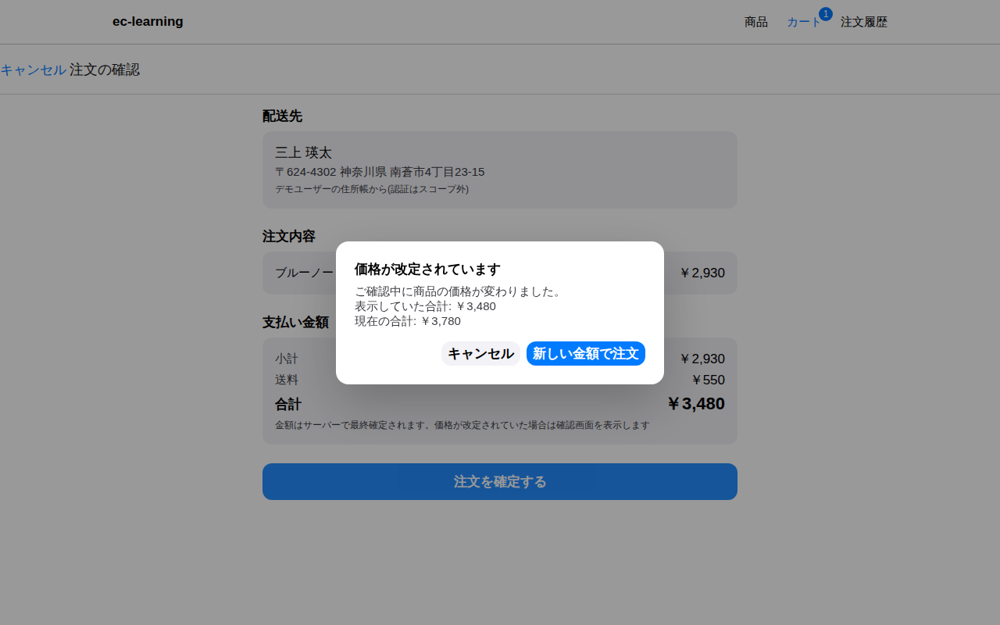 | 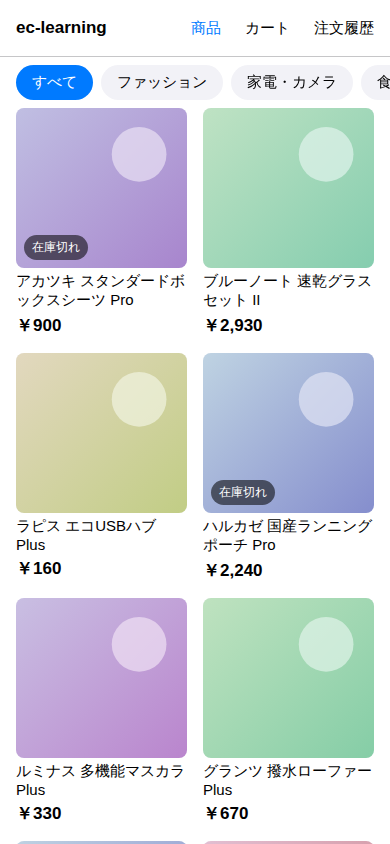 |
| `Alert.alert` は web に無いので、`DialogSpec` を挟んで native=OS Alert / web=モーダルに分岐。エラー→表示の対応表は1本のまま | 同じ web を狭幅で開くと2列。ブレークポイントは md=768 / lg=1024 の2段のみ |

- **プラットフォームごとに正解が違う chrome**: iOS は親指到達性由来の下タブ(NativeTabs)、web は
  カーソルとスクロール文脈由来のヘッダーナビ。web は `_layout.web.tsx` のヘッドレスタブ
  (`expo-router/ui`)でタブのマウント状態を保ちつつ、見た目のナビは `site-header.web.tsx` に委ねる
- **分岐は同居ファイルで**: `site-header` / `app-dialog` / `sf-symbol`(SF Symbols → Material Icons)/
  `use-grid-columns` はすべて `<name>.web.tsx` の同居分岐。画面コードの import は1本のまま
- **409 ダイアログも web で実証**: 上のスクリーンショットは DB の価格を直接改定してから確定ボタンを
  押し、サーバーの 409 を実際に受けて出したもの(iOS と同じ手順)
- 前提: Go API に CORS 対応がまだ無いため、ブラウザからの実 API 接続は preflight で失敗する
  (native の fetch には CORS が無い — この非対称が API 側に CORS 設計を要求する。`src/api/client.ts` のコメント参照)。
  上のスクリーンショットは検証用にブラウザ側で CORS ヘッダを補って撮影。商品画像も撮影環境から
  picsum.photos に到達できず、商品IDで色を決めたプレースホルダに差し替えている

## 技術構成

| 領域 | 選定 | 補足 |
|---|---|---|
| フレームワーク | Expo SDK 57(development build) | 開発UIの写り込み等の理由で Expo Go から移行 |
| ルーティング | expo-router / **NativeTabs**(本物の UITabBarController) | Liquid Glass・タブ最小化・ネイティブバッジ |
| データ取得 | TanStack Query | `useInfiniteQuery` × サーバーの `next_cursor`(カーソル方式 [ADR 006](../docs/decisions/006-pagination.md)) |
| クライアント状態 | zustand | カートのみ(DBにカートを作らない決定) |
| デザイン | セマンティックカラー + 自作トークン(`src/theme/`) | トークン逸脱の監査: 4件/1,683行・全件意図コメント付き。アクセントは systemBlue |
| Apple Watch | SwiftUI ネイティブ + `@bacons/apple-targets` | RN は watchOS 非対応。閲覧のみ・API 直接取得([ADR 008](../docs/decisions/008-apple-watch-browsing.md)) |
| Live Activity | SwiftUI ウィジェット拡張 + ローカル Expo Module | 注文直後にロック画面 / Dynamic Island。進捗はクライアント側の疑似([ADR 009](../docs/decisions/009-order-live-activity.md)) |
| Web | react-native-web + expo-router 静的出力 | ヘッダーナビ・レスポンシブグリッド・モーダルダイアログを `.web.tsx` 同居分岐で。CORS は API 側の宿題 |
| パッケージ管理 | pnpm(mise でバージョン固定) | 操作の入口はリポジトリルートの mise タスク |

## 設計の要点

- **API契約は型で固定**: `src/api/types.ts` は Go 側 json タグの1:1写し。エラーも
  `ApiError{status, body}` に統一し(ネットワーク断も status=0 で契約に畳む)、
  エラーUXは `instanceof` 1本で分岐する
- **差し替え境界**: `src/api/client.ts` の関数シグネチャが画面との境界。
  モック実装 → fetch 実装の差し替えで、画面側に必要だった変更は AbortSignal の配線だけ
- **規約**: コンポーネントは `components/<name>/<name>.tsx` のディレクトリ単位
  (`.web.tsx` 分岐余地)。`src/app/` はルート専用、画面本体は `src/screens/`
- **検証**: [agent-device](https://github.com/callstack/agent-device) でエージェントが
  シミュレータを直接操作し、スクリーンショット→評価→修正のループで磨いた

## 動かし方

```sh
# リポジトリルートで(DB・API)
mise run up && mise run migrate && mise run seed && mise run load
mise run api-run                 # Go API(:8080)

# モバイル
mise run mobile-install
mise run mobile-prebuild         # CNG: ios/ は生成物(git管理外)
mise run mobile-prebuild-clean   # ios/ を消して作り直す(targets/ や modules/ を追加・改名したとき)
cp mobile/.env.local.example mobile/.env.local   # 任意: Apple Team ID など環境依存の値(app.config.ts が注入。シミュレータのみなら不要)
mise run mobile-ios              # ローカルビルド → iPhone 17 Pro シミュレータで起動(EC_IOS_DEVICE で端末差し替え。slug/scheme は他プロジェクトと衝突しないよう "eclearning" — 理由は mise.toml のコメント)
mise run mobile-watch            # Watch アプリを単体ビルド → ペアリング済み Watch シミュレータで起動(要: Booted な iPhone/Watch ペア)
mise run mobile-xcode            # Xcode で開く(必ず .xcworkspace。.xcodeproj だと Pods が入らず失敗)
mise run mobile-start -- --web   # ブラウザで開く(実 API 接続は Go 側の CORS 対応待ち — 上の Web 節を参照)
mise run mobile-check            # tsc + eslint
```

前提: 認証はスコープ外(デモユーザー固定 — `src/constants.ts`)。
iOS 優先(Liquid Glass は iOS 26+。Android は Material フォールバック前提のコメントを各所に残置)。
